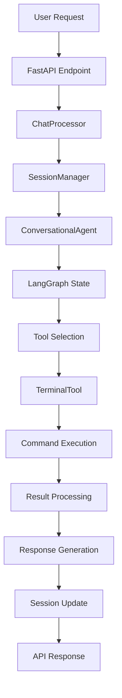

# 🧠 Agentic Chain of Thought: Anatomy of a Request

## 📝 Example: "Count the number of files in the current directory"

Here's what happens behind the scenes when a user makes this request:

---

## 🌊 **PHASE 1: Reception and Preprocessing**

### 📍 Entry Point: `endpoints.py`

```python
# endpoints.py - chat() function (line 81)
@app.post("/chat", response_model=ChatResponse)
def chat(request: ChatRequest):
```

**What happens:**
1. FastAPI receives the POST request to `/chat`
2. Session ID validation via `SessionManager`
3. Request logging: `log_step(session_id, "chat_request_received")`
4. User message addition to conversation history

**Code involved:**
```python
# endpoints.py lines 93-95
user_message = {"role": "user", "content": request.message}
session_manager.add_message(request.session_id, user_message)
```

---

## 🧩 **PHASE 2: Context Interpretation**

### 📍 Context Processor: `ChatProcessor.process_user_input()` 

```python
# endpoints.py - ChatProcessor (line 26)
def process_user_input(self, user_message: str, session_id: str, safe_mode: bool):
```

**What happens:**
1. **Pending command check**: Verifies if there's a command awaiting confirmation
2. **Context retrieval**: Retrieves conversation history from `SessionManager`
3. **Safe mode evaluation**: Determines whether to activate safe mode

**Reasoning:** "User asked to count files... no pending commands... proceeding in normal mode"

---

## 🤖 **PHASE 3: Main Agent Orchestration**

### 📍 Agent Entry: `conversational.py - ConversationalAgent.run_turn()`

```python
# conversational.py - run_turn() method
def run_turn(self, user_input: str, session_id: str, safe_mode: bool, confirmed_command: str = None):
```

**Internal Chain of Thought:**

1. **System Prompt Injection** (`_create_system_prompt()`)
   ```python
   # conversational.py lines 34-39
   with open(kb_path, 'r') as f:
       self.kb_guidelines = f.read()
   ```
   - Loads guidelines from `knowledge_base/agent_guidelines.md`
   - Contains specific rules for Terminal, Browser, Microsoft Fabric

2. **LangGraph State Initialization**
   ```python
   # conversational.py lines 18-21
   class AgentState(TypedDict):
       messages: Annotated[Sequence[BaseMessage], add]
       pending_tool_confirmation: Optional[dict]
   ```

---

## 🎯 **PHASE 4: Planning and Tool Selection**

### 📍 LangChain Tool Calling Agent

```python
# conversational.py - _create_system_prompt()
system_prompt = """You are a helpful AI assistant..."""
```

**Reasoning Process:**
1. **Intent Recognition**: "User wants to count files in current directory"
2. **Tool Analysis**: Analyzes available tools from `tools/registry.py`
3. **Tool Selection**: Identifies `TerminalTool` as appropriate
4. **Command Planning**: Plans command `ls | wc -l` or `find . -maxdepth 1 -type f | wc -l`

**Available tools** (`registry.py`):
```python
def get_tools(llm=None, safe_mode: bool = True) -> List[Tool]:
    return [
        TerminalTool(safe_mode=safe_mode),    # ← SELECTED for file counting
        SearchTool(),
        BrowserIntegrationTool(llm=llm),
    ]
```

---

## ⚡ **PHASE 5: Execution**

### 📍 Tool Execution: `terminal.py - TerminalTool._run()`

**Safe Mode Check:**
```python
# terminal.py - _run() method
if self.safe_mode and not self._is_safe_command(command):
    # Requires user confirmation
    raise TerminalConfirmationRequired(command)
```

**Execution Flow:**
1. **Generated command**: `find . -maxdepth 1 -type f | wc -l`
2. **Safety check**: Verifies if command is safe
3. **Execution**: Executes command via `subprocess.run()`
4. **Timeout protection**: 30-second timeout
5. **Result capture**: Captures output and errors

**Execution code:**
```python
# terminal.py - execute_command()
result = subprocess.run(
    command, shell=True, capture_output=True, 
    text=True, timeout=30, cwd=working_dir
)
```

---

## 🔄 **PHASE 6: Response Generation**

### 📍 Response Assembly: Back to `ConversationalAgent`

**Post-processing:**
1. **Result interpretation**: Agent interprets numeric output (e.g., "5")
2. **Context enrichment**: Adds human explanation
3. **Response formatting**: Formats final response

**Typical response:**
> "I counted the files in the current directory. There are 5 files in total.
> 
> I used the command `find . -maxdepth 1 -type f | wc -l` which:
> - Finds all files (-type f) in the current directory
> - Limits search to current level (-maxdepth 1)  
> - Counts output lines (wc -l)"

---

## 📊 **PHASE 7: State Management and Logging**

### 📍 Session Update: `session.py - SessionManager`

```python
# session.py - add_message()
def add_message(self, session_id: str, message: dict):
    if session_id in self.sessions:
        self.sessions[session_id].append(message)
```

**Final Steps:**
1. **Message storage**: Saves response to session history
2. **Logging**: `log_step(session_id, "agent_processing_complete")`
3. **Response delivery**: Returns `ChatResponse` to frontend

---

## 🏗️ **Architecture Component Map**

```
📁 agentic_assistant/
├── 🌐 api/
│   ├── endpoints.py      → Entry point, routing, ChatProcessor
│   └── models.py         → ChatRequest, ChatResponse, data models
├── 🤖 agents/
│   └── conversational.py → ConversationalAgent, LangGraph, reasoning
├── 🔧 tools/
│   ├── registry.py       → Tool selection, get_tools()
│   ├── terminal.py       → TerminalTool, command execution  
│   ├── search.py         → SearchTool, web search
│   └── browser_integration.py → BrowserTool, web automation
├── 🧠 core/
│   ├── session.py        → SessionManager, conversation persistence
│   ├── config.py         → LLM config, environment setup
│   └── logging.py        → log_step(), session tracking
└── 📚 knowledge_base/
    └── agent_guidelines.md → Domain expertise, tool usage rules
```

---

## 🎭 **Chain of Thought Summary**

1. **🌊 Input Reception** → `endpoints.py:chat()` receives request
2. **🧩 Context Analysis** → `ChatProcessor.process_user_input()` analyzes context  
3. **🤖 Agent Reasoning** → `ConversationalAgent` applies LangChain reasoning
4. **🎯 Tool Planning** → Selects `TerminalTool` from `registry.py`
5. **⚡ Execution** → `terminal.py` executes command with safety checks
6. **🔄 Response Gen** → Agent formulates understandable response
7. **📊 State Update** → `SessionManager` updates history

**The system demonstrates a true "agentic chain of thought"** where each component has a specific role in understanding, planning, and executing the user's request! 🚀

---

## 🔍 **Advanced Technical Details**

### LangGraph State Machine
The system uses LangGraph to manage conversational flow as a state machine:
- **State**: Maintains messages and tool confirmation state
- **Transitions**: Manages flow between understanding, planning, execution
- **Memory**: Persists context between interactions

### Tool Selection Algorithm
The agent uses LangChain's algorithm for automatic tool selection:
1. Semantic analysis of user input
2. Matching with available tool capabilities
3. Ranking based on confidence and appropriateness
4. Selection of best tool with optimal parameters

### Safety & Security
- **Safe Mode**: Potentially dangerous commands require confirmation
- **Sandboxing**: Isolated execution with timeouts
- **Validation**: Input sanitization and output filtering
- **Logging**: Complete tracing for audit and debugging

### Browser Automation Features
- **User Intervention**: Pause/resume system for manual control
- **Adaptive Execution**: Automatic error handling and fallbacks
- **Cross-Platform**: Windows/WSL support with appropriate async handling

---

## 🚀 **Request Flow Diagram**



---

## 🎯 **Key Design Principles**

### 1. **Separation of Concerns**
- **API Layer**: Handles HTTP requests/responses
- **Agent Layer**: Manages reasoning and orchestration
- **Tool Layer**: Executes specific actions
- **Core Layer**: Provides shared utilities and state management

### 2. **Extensibility**
- **Tool Registry**: Easy addition of new capabilities
- **Plugin Architecture**: Modular tool design
- **Configuration Management**: Environment-based setup

### 3. **Reliability**
- **Error Handling**: Graceful fallbacks at every level
- **Timeout Protection**: Prevents hanging operations
- **Safety Checks**: User confirmation for risky operations

### 4. **Observability**
- **Structured Logging**: Detailed request tracing
- **Session Management**: Conversation state persistence
- **Debug Information**: Component-level insights

---

## 🛠️ **Development Guidelines**

### Adding New Tools
1. Create tool class inheriting from `BaseTool`
2. Implement `_run()` and `_arun()` methods
3. Add to `tools/registry.py`
4. Update knowledge base guidelines
5. Add safety considerations

### Modifying Agent Behavior
1. Update system prompt in `conversational.py`
2. Modify state schema if needed
3. Adjust LangGraph flow if required
4. Test with various input patterns

### Extending API
1. Define new models in `api/models.py`
2. Add endpoints in `api/endpoints.py`
3. Update session management if needed
4. Maintain backward compatibility

This architecture guide provides a comprehensive understanding of how the agentic assistant processes and responds to user requests through its sophisticated chain of thought mechanism.